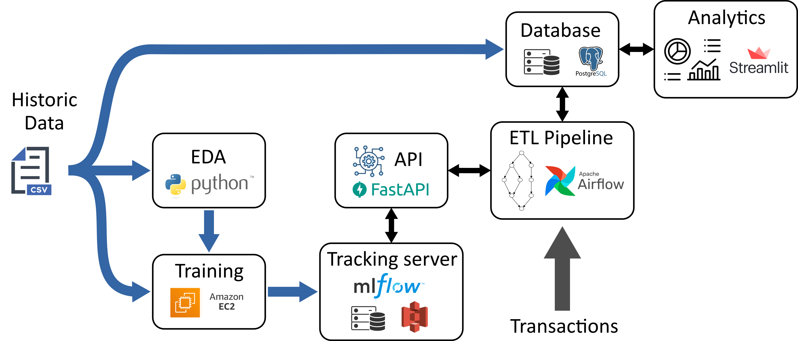
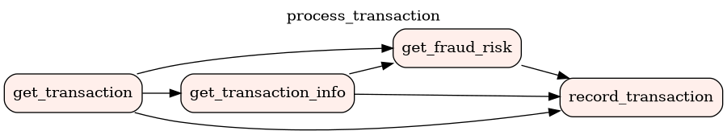

# Automatic Fraud Detection

This project focuses on developing and deploying a real-time fraud detection system to combat financial fraud, a major concern for financial institutions. Leveraging machine learning, the goal is to accurately identify fraudulent transactions and integrate this capability into a production-ready infrastructure that can notify stakeholders as fraud occurs and generate daily reports on all payment activity.

The pipeline produced is presented below. We train fraud detection models using a labeled dataset of past transactions, and then integrate it with a real-time payment API that updates every minute. The fraud detection algorithms are managed with an MLflow server and made available through an API. The ETL pipeline is orchestrated with Airflow through a succession of tasks:
- Fetch a transaction from the payment API;
- Process the data to extract features;
- Request the fraud detection API to get a fraud risk indicator;
- Store the resulting data in a SQL database. 
The SQL database contains reference tables containing merchants and customers information, along with a table that stores transaction events. The contents of the `transactions` table is accessed by a dashboard that provides analytics.

    
    <em>image_caption</em>

    
    <em>image_caption</em>

## Structure of the project

This project repository is structured as follows.
- The Jupyter notebook `Automatic_Fraud_Detection - study.ipynb` presents the study of the data: data analysis and model construction.
- The directory `scripts` contains the study as a python script.
- The directory `train` contains scripts and utilities to dispatch the training of pricing models on AWS EC2 instances.
- The directory `mlflow` contains !!!
- The directory `api` contains !!!
- The directory `airflow_engine` contains !!!
- The directory `dashboard` contains !!!
- The directory `presentation` contains the slideshow for the exam, in both `odp` and `pdf` formats.